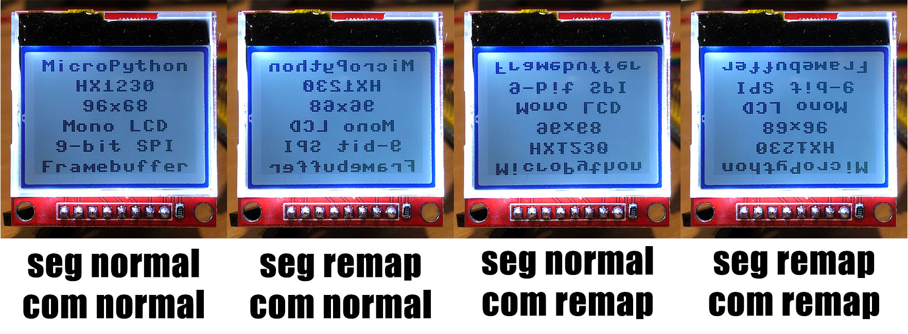

# MicroPython HX1230

MicroPython library for HX1230 96x68 monochrome LCD displays.

Marketed as an upgrade of the [Nokia 5110 LCD](https://github.com/mcauser/micropython-pcd8544) (PCD8544 84x48).


#### Pinout

Pin | Name | Description
:--:|:----:|:--------------------------------
1   | RST  | External reset input, active low
2   | CE   | Chip enable, active low
3   | N/C  | Not connected
4   | DIN  | Serial data input
5   | CLK  | Serial clock, up to 4 Mbits/s
6   | VCC  | Supply voltage 3.3-5V
7   | BL   | Backlight 3.3-5V
8   | GND  | Ground

You can save a GPIO pin by connecting RST to VCC and relying on the software reset command.

You can save another GPIO pin by connecting BL to VCC, but you will no longer be able to toggle the backlight in software.

## Example

**Basic Example**

```python
# Wemos D1 Mini ESP8266
from machine import Pin, SPI
import hx1230_fb

spi = SPI(1)
spi.init(baudrate=4000000, polarity=0, phase=0)
cs = Pin(2)
rst = Pin(0)

# backlight on
bl = Pin(4, Pin.OUT, value=1)

lcd = hx1230_fb.HX1230_FB_SPI(spi, cs, rst)

# test pattern (50% on)
lcd.data(bytearray([0x55, 0xAA] * 48 * 9))

# write some text using Frambuffer
lcd.fill(0)
lcd.show()
lcd.text('MicroPython',4,0,1)
lcd.text('HX1230',24,12,1)
lcd.text('96x68',28,24,1)
lcd.text('Mono LCD',16,36,1)
lcd.text('9-bit SPI',12,48,1)
lcd.text('Framebuffer',4,60,1)
lcd.show()
```

See [/examples](/examples) for more detailed examples.

## Interfaces

There are 2 versions of this library. `hx1230.py` and `hx1230_fb.py`.

* hx1230.py - base version, does not extend anything.
* hx1230_fb.py - extends framebuf.FrameBuffer and provides additional drawing methods.

Both use either SPI or bit-bang SPI to communicate with the display.

### SPI

The display uses 9-bit SPI, where the MSB is DC (data/command).
Both data and commands are sent as 2 bytes, with 7 unused bits in the lower byte.

Data bits are sent MSB first. The least significant data bit is the top most pixel
and the most significant data bit is the lowest pixel in the page on the display.

```python
# VCC GND STM32F407ZGT6
from machine import Pin, SPI
spi = SPI(2)
spi.init(baudrate=2000000, polarity=0, phase=0)
cs = Pin('B12', Pin.OUT)
rst = Pin('B11', Pin.OUT)
bl = Pin('B1', Pin.OUT, value=1)  # backlight on

# without framebuffer
import hx1230
lcd = hx1230.HX1230_SPI(spi, cs, rst)
lcd.data([255,127,63,31,15,7,3,1])

# with framebuffer
import hx1230_fb
lcd = hx1230_fb.HX1230_FB_SPI(spi, cs, rst)
lcd.text('hello',0,0,1)
lcd.show()
```

### Bit-Bang SPI

In this mode, exactly 9 bits are sent each time, with DC as the MSB.
```python
# VCC GND STM32F407ZGT6
from machine import Pin
mosi = Pin('B15', Pin.OUT)
sck = Pin('B13', Pin.OUT)
cs = Pin('B12', Pin.OUT)
rst = Pin('B11', Pin.OUT)
bl = Pin('B1', Pin.OUT, value=1)  # backlight on

# without framebuffer
import hx1230
lcd = hx1230.HX1230_BBSPI(mosi, sck, cs, rst)
lcd.data([255,127,63,31,15,7,3,1])

# with framebuffer
import hx1230_fb
lcd = hx1230_fb.HX1230_FB_BBSPI(spi, cs, rst)
lcd.text('hello',0,0,1)
lcd.show()
```

## Methods

Initialisation.
```python
init(contrast, seg_remap, com_remap, start)
```

Reset the display. Performs a software reset when no RST pin provided.
```python
reset(software=False)
```

Provide power to the display.
```python
power(on=True)
```

Set the display contrast in the range 0-31. 0 is faint, 31 is dark.
```python
contrast(contrast=15)
```

Invert the display.
```python
invert(invert=True)
```

Turn the display on/off.
```python
display(on=True)
```

Toggle test mode, which turns all pixels on (or off when in inverted mode).
```python
test(on=True)
```

Set the pixel orientation. Seg remap to flip horizontal, com remap to flip vertical.
Both seg remap and com remap to rotate 180 degrees.
In normal operation, the black strip on the display is at the top.
```python
orientation(seg_remap=False, com_remap=False)
```

Move the cursor for the next write.
The x is column (0-95) and the y is the page (0-9).
Pixels are arranged in horizontal pages of 96x8 pixels.
The display is 68 pixels tall. 68 / 8 = 8.5, rounded up is 9 pages.
The bottom 4 pixels are last page are ignored.
```python
position(x, y)
```

Shifts the entire display down. Range is 0-63. Pixels wrap around.
```python
start_line(line=0)
```

Fills the entire DDRAM with a colour. Then resets x,y position to 0,0
```python
clear(color=0)
```

Writes a command to the display
```python
command(command)
```

Writes data to the display
```python
data(data)
```

## Additional FrameBuffer methods

Fill the entire FrameBuffer with a colour.
```python
fill(color)
```

Sets a pixel to the given colour. When color is not provided, gets the pixel colour.
```python
pixel(x, y, color)
```

Shifts the display contents by the given vector. Previous contents remain.
```python
scroll(dx, dy)
```

Writes text using the built in monospace 8x8 font
```python
text(string, x, y, color)
```

Draws a line from the given coordinates, 1px thick, using the given colour.
```python
line(x1, y1, x2, y2, color)
```

Draws a horizontal line, 1px thick, using the given colour.
```python
hline(x, y, w, color)
```

Draws a vertical line, 1px thick, using the given colour.
```python
vline(x, y, h, color)
```

Draws a 1px thick rectangle at the given location using the given colour.
```python
rect(x, y, w, h, color)
```

Draws a filled rectangle at the given location using the given colour.
```python
fill_rect(x, y, w, h, color)
```

Writes the entire framebuffer to the display.
```python
show()
```

## Commands

Command         | D/C | D7 | D6 | D5 | D4 | D3 | D2 | D1 | D0 | Description                | Initial
--------------- | --- | -- | -- | -- | -- | -- | -- | -- | -- | -------------------------- | -------
Set power       | 0   | 0  | 0  | 1  | 0  | P3 | P2 | P1 | P0 | P=15: On, P=8: Off         | 0x2F
Set contrast    | 0   | 1  | 0  | 0  | C4 | C3 | C2 | C1 | C0 | C=0: Faint, C=31: Dark     | 0x8F
Set inverted    | 0   | 1  | 0  | 1  | 0  | 0  | 1  | 1  | I  | I=0: Normal, I=1: Inverted | 0xA6
All pixels on   | 0   | 1  | 0  | 1  | 0  | 0  | 1  | 0  | A  | A=0: Normal, A=1: All On   | 0xA4
Display enable  | 0   | 1  | 0  | 1  | 0  | 1  | 1  | 1  | D  | D=0: Off, D=1: On          | 0xAF
Set page        | 0   | 1  | 0  | 1  | 1  | 0  | Y2 | Y1 | Y0 | Y=0~7: Page                | 0xB0
Set column low  | 0   | 0  | 0  | 0  | 0  | X3 | X2 | X1 | X0 | X=0~15: Column low 4 bits  | 0x00
Set column high | 0   | 0  | 0  | 0  | 1  | 0  | X6 | X5 | X4 | X=0~7: Column high 3 bits  | 0x10
Set scan start  | 0   | 0  | 1  | S5 | S4 | S3 | S2 | S1 | S0 | S=0~63: Start Line         | 0x40
SEG remap       | 0   | 1  | 0  | 1  | 0  | 0  | 0  | 0  | S  | S=0: Normal, S=1: remap    | 0xA0
COM remap       | 0   | 1  | 1  | 0  | 0  | C  | 0  | 0  | 0  | C=0: Normal, C=1: remap    | 0xC0
Software reset  | 0   | 1  | 1  | 1  | 0  | 0  | 0  | 1  | 0  | 0xE2                       | -
Write data      | 1   | D7 | D6 | D5 | D4 | D3 | D2 | D1 | D0 | D=0~255: Data              | -

## Addressing and orientation

The displays memory is compatible with the Framebuffer [MONO_VLSB](http://docs.micropython.org/en/latest/library/framebuf.html#framebuf.framebuf.MONO_VLSB) format.

You can remap the segment and common output pins to flip the display horizontally, vertical or both - which is the same as a rotate 180 deg.



## Parts

* [HX1230](https://www.aliexpress.com/item/32810394997.html) $2.60 AUD
* [WeMos D1 Mini](https://www.aliexpress.com/item/32529101036.html) $5.25 AUD
* [VCC GND STM32F407VGT6](https://www.aliexpress.com/item/33012284134.html) $35.52 AUD

## Connections

WeMos D1 Mini | HX1230 LCD
------------- | ----------
D3 (GPIO0)    | 1 RST
D4 (GPIO2)    | 2 CE
n/a           | 3 N/C
D7 (GPIO13)   | 4 DIN
D5 (GPIO14)   | 5 CLK
3V3           | 6 VCC
D2 (GPIO4)    | 7 BL
G             | 8 GND

VCC GND ZGT6  | HX1230 LCD
------------- | ----------
B11           | 1 RST
B12 SPI2 CS   | 2 CE
n/a           | 3 N/C
B15 SPI2 MOSI | 4 DIN
B13 SPI2 SCK  | 5 CLK
3V3           | 6 VCC
B1            | 7 BL
GND           | 8 GND

## Links

* [WeMos D1 Mini](https://wiki.wemos.cc/products:d1:d1_mini)
* [micropython.org](http://micropython.org)
* [Docs on framebuf](http://docs.micropython.org/en/latest/library/framebuf.html)
* [HX1230 datasheet in Chinese](docs/hx1230_datasheet.pdf)
* [HX1230 datasheet converted to English](docs/hx1230_datasheet_en.pdf)

## License

Licensed under the [MIT License](http://opensource.org/licenses/MIT).
